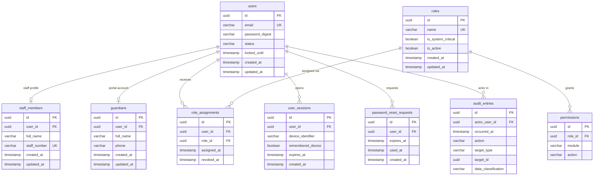

---
# Module 01 — Identity, Access & Audit

**Tables owned by this module:** `users`, `staff_members`, `guardians`, `roles`, `role_assignments`, `permissions`, `user_sessions`, `password_reset_requests`, `audit_entries`

**Cross-module stubs shown:** _(none — this is the root identity module referenced by all others)_

**Enum values**

| Column | Values |
|---|---|
| `users.status` | `active`, `inactive`, `locked` |
| `permissions.action` | `view`, `create`, `edit`, `delete`, `approve` |

**Key rules**
- `users.email` is globally unique
- Five failed logins lock the account for 15 minutes (`locked_until`)
- A `staff_member` or `guardian` without a `user` record cannot authenticate
- System-critical roles and roles held by active staff cannot be deleted
- `audit_entries` are append-only; never update or delete rows in this table
