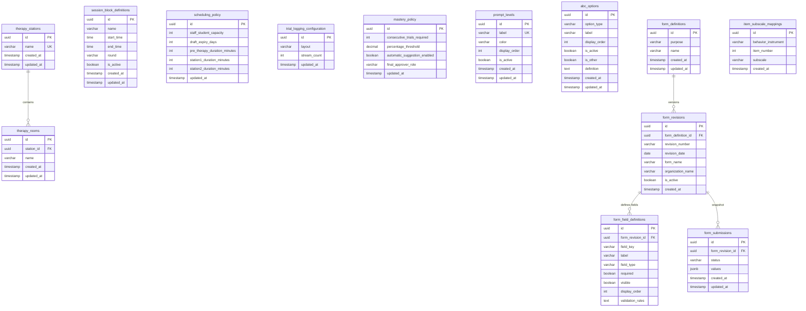

# Module 02 — Clinical Configuration, Forms & Facilities

**Tables owned:** `therapy_stations`, `therapy_rooms`, `session_block_definitions`, `scheduling_policy`, `trial_logging_configuration`, `mastery_policy`, `prompt_levels`, `abc_options`, `form_definitions`, `form_revisions`, `form_field_definitions`, `form_submissions`, `item_subscale_mappings`

**Cross-module stubs:** _(none — configuration tables are referenced by other modules, not the reverse)_

**Enum values**

| Column | Values |
|---|---|
| `trial_logging_configuration.layout` | `horizontal`, `vertical`, `card_grid` |
| `form_definitions.purpose` | `enrollment`, `iup`, `ablls`, `social_skills_questionnaire` |
| `form_submissions.status` | `draft`, `submitted` |
| `abc_options.option_type` | `behavior`, `antecedent`, `consequence`, `location`, `frequency`, `intensity`, `category` |

**Key rules**
- `scheduling_policy` is a singleton — one row per organisation; use PUT to update, never POST a second row
- `trial_logging_configuration.stream_count` must be between 3 and 20
- A submitted `form_submission` is permanently linked to its `form_revision`; its `values` column is immutable after submission
- `item_subscale_mappings` seeds the MAS-II scoring key: 16 rows mapping `question_number` 1–16 to subscales Sensory, Escape, Attention, Tangible
- `session_block_definitions.end_time` must be later than `start_time`
