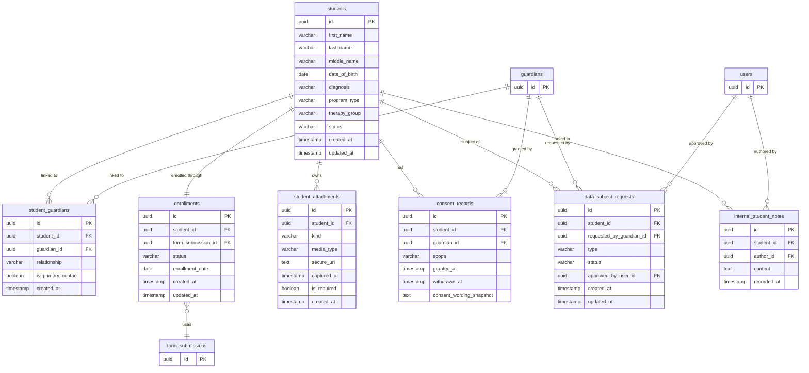

# Module 03 — Students, Enrollment, Consent & Data Rights

**Tables owned:** `students`, `student_guardians`, `enrollments`, `student_attachments`, `consent_records`, `data_subject_requests`, `internal_student_notes`

**Cross-module stubs:** `users` (→ 01-identity), `guardians` (→ 01-identity), `form_submissions` (→ 02-configuration)

**Enum values**

| Column | Values |
|---|---|
| `students.program_type` | `regular`, `pulled_out` |
| `students.therapy_group` | `basic`, `functional_living` |
| `students.status` | `in_assessment`, `assessment_complete`, `ready_for_iup`, `active_therapy`, `withdrawn`, `discharged` |
| `enrollments.status` | `draft`, `confirmed`, `purged` |
| `student_attachments.kind` | `birth_certificate`, `medical_diagnosis`, `agreement`, `headshot`, `baseline_video` |
| `consent_records.scope` | `child_data`, `medical_records`, `photos`, `video`, `audio_recording` |
| `data_subject_requests.type` | `access`, `erasure` |
| `data_subject_requests.status` | `pending`, `approved`, `completed` |
| `student_guardians.relationship` | `parent`, `legal_guardian`, `other` |

**Key rules**
- Enrollment confirmation requires: all required form fields, at least one primary guardian, required consents, and the headshot attachment
- Confirming enrollment transitions `students.status` to `in_assessment`
- Basic Therapy age expectation is 3–12; Functional Living Skills is 13–19 — a mismatch triggers a warning, not a hard rejection
- `internal_student_notes` must never be returned by parent or teacher-facing API endpoints
- Erasure requests require Director approval and must produce an `audit_entries` record
