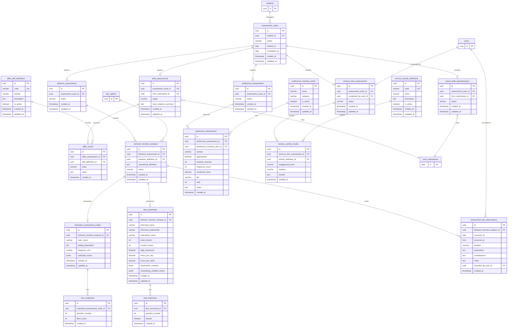

# Module 04 — Six-Week Assessment

**Tables owned:** `assessment_cycles`, `skills_assessments`, `ablls_skill_definitions`, `ablls_scores`, `behavior_assessments`, `behavior_function_analyses`, `motivation_assessment_scales`, `mas_responses`, `fast_screenings`, `fast_responses`, `assessment_abc_observations`, `preference_assessments`, `preference_inventory_items`, `preference_observations`, `sensory_time_assessments`, `sensory_activity_definitions`, `sensory_activity_results`, `social_skills_questionnaires`

**Cross-module stubs:** `students` (→ 03-students), `users` (→ 01-identity), `abc_options` (→ 02-configuration), `form_submissions` (→ 02-configuration)

**Enum values**

| Column | Values |
|---|---|
| `assessment_cycles.status` | `in_progress`, `complete`, `reviewed` |
| `skills_assessments.status` | `draft`, `submitted` |
| `ablls_scores.value` | `0`, `1`, `2`, `not_applicable` |
| `behavior_function_analyses.status` | `in_progress`, `complete` |
| `motivation_assessment_scales.frequency_unit` | `year`, `month`, `week`, `day`, `hour` |
| `mas_responses.likert_score` | `0`–`6` |
| `fast_screenings.informant_relationship` | `parent`, `teacher_instructor`, `residential_staff`, `other` |
| `preference_observations.context` | `sensory_time`, `circle_time`, `play_time` |
| `preference_observations.tier` | `highest`, `moderate`, `low` |
| `sensory_activity_results.engagement_level` | `high`, `moderate`, `low`, `none` |
| `sensory_activity_results.reaction` | `positive`, `neutral`, `negative` |

**Key rules**
- An `assessment_cycle` cannot be marked `complete` until `skills_assessments`, `behavior_assessments`, and `preference_assessments` are all submitted
- Marking a cycle `reviewed` transitions the student to `ready_for_iup`
- A `behavior_assessment` is complete only when every child `behavior_function_analyses` row is complete
- `mas_responses` requires all 16 rows (items 1–16) before the MAS scale can be marked complete — no partial saves
- `fast_responses` items 1–3 and 19–27 are always required; items 4–18 are required only if any of items 1–3 is `true`
- `social_skills_questionnaires` uses the same `form_submissions` snapshot pattern — submitted values are immutable
