# Module 05 — IUP, Goal Bank & Mastery Governance

**Tables owned:** `goal_domains`, `goals`, `task_analysis_step_templates`, `iups`, `iup_signatures`, `student_goals`, `student_goal_steps`, `goal_mastery_checks`, `mastery_verifications`

**Cross-module stubs:** `students` (→ 03-students), `assessment_cycles` (→ 04-assessment), `users` (→ 01-identity), `staff_members` (→ 01-identity), `therapy_stations` (→ 02-configuration), `form_submissions` (→ 02-configuration), `prompt_levels` (→ 02-configuration)

```mermaid
erDiagram

    %% ── Owned tables ──────────────────────────────────────────

    goal_domains {
        uuid id PK
        varchar name UK
        text description
        int display_order
        boolean is_active
        timestamp created_at
        timestamp updated_at
    }

    goals {
        uuid id PK
        uuid goal_domain_id FK
        varchar name
        varchar type
        text description
        jsonb mastery_criteria_template
        jsonb suggested_age_range
        jsonb applicable_therapy_groups
        boolean is_active
        timestamp created_at
        timestamp updated_at
    }

    task_analysis_step_templates {
        uuid id PK
        uuid goal_id FK
        int step_number
        text description
        jsonb mastery_criteria
        timestamp created_at
    }

    iups {
        uuid id PK
        uuid student_id FK
        uuid assessment_cycle_id FK
        uuid form_submission_id FK
        varchar status
        date finalized_on
        timestamp created_at
        timestamp updated_at
    }

    iup_signatures {
        uuid id PK
        uuid iup_id FK
        uuid signer_user_id FK
        varchar signer_role
        timestamp signed_at
        text signature_evidence
    }

    student_goals {
        uuid id PK
        uuid iup_id FK
        uuid student_id FK
        uuid goal_id FK
        uuid station_id FK
        varchar status
        decimal progress_percent
        text clinical_note
        timestamp created_at
        timestamp updated_at
    }

    student_goal_steps {
        uuid id PK
        uuid student_goal_id FK
        uuid task_analysis_step_template_id FK
        int step_number
        decimal independence_percent
        varchar status
        timestamp created_at
        timestamp updated_at
    }

    goal_mastery_checks {
        uuid id PK
        uuid student_goal_id FK
        uuid primary_teacher_id FK
        varchar status
        decimal primary_independence_percent
        timestamp submitted_at
        text rejection_reason
        timestamp created_at
        timestamp updated_at
    }

    mastery_verifications {
        uuid id PK
        uuid mastery_check_id FK
        uuid verifier_id FK
        varchar outcome
        uuid prompt_level_id FK
        text notes
        timestamp verified_at
    }

    %% ── Cross-module stubs ────────────────────────────────────

    students {
        uuid id PK
        %% see 03-students.md
    }

    assessment_cycles {
        uuid id PK
        %% see 04-assessment.md
    }

    users {
        uuid id PK
        %% see 01-identity.md
    }

    staff_members {
        uuid id PK
        %% see 01-identity.md
    }

    therapy_stations {
        uuid id PK
        %% see 02-configuration.md
    }

    form_submissions {
        uuid id PK
        %% see 02-configuration.md
    }

    prompt_levels {
        uuid id PK
        %% see 02-configuration.md
    }

    %% ── Relationships ─────────────────────────────────────────

    goal_domains ||--o{ goals : "groups"
    goals ||--o{ task_analysis_step_templates : "defines steps"

    students ||--o{ iups : "has"
    assessment_cycles ||--o{ iups : "informs"
    iups }o--|| form_submissions : "uses"
    iups ||--o{ iup_signatures : "signed by"
    users ||--o{ iup_signatures : "signer"

    iups ||--o{ student_goals : "owns"
    goals ||--o{ student_goals : "selected"
    therapy_stations ||--o{ student_goals : "practiced at"

    student_goals ||--o{ student_goal_steps : "instantiates"
    task_analysis_step_templates ||--o{ student_goal_steps : "from template"

    student_goals ||--o{ goal_mastery_checks : "submits"
    staff_members ||--o{ goal_mastery_checks : "primary teacher"

    goal_mastery_checks ||--o{ mastery_verifications : "verified by"
    staff_members ||--o{ mastery_verifications : "verifier"
    prompt_levels ||--o{ mastery_verifications : "prompt level"
```

**Enum values**

| Column | Values |
|---|---|
| `goals.type` | `standard`, `task_analysis` |
| `iups.status` | `draft`, `active`, `archived` |
| `iup_signatures.signer_role` | `program_director`, `guardian` |
| `student_goals.status` | `active`, `in_progress`, `mastered`, `archived` |
| `student_goal_steps.status` | `not_started`, `in_progress`, `mastered` |
| `goal_mastery_checks.status` | `draft`, `awaiting_verification`, `pending_approval`, `approved`, `rejected` |
| `mastery_verifications.outcome` | `success`, `fail` |

**Key rules**
- At most one `iup` with `status = active` per student at any time — activating a new IUP archives the prior one
- IUP finalization requires: at least one `student_goal` per applicable station, exactly one `program_director` signature, and exactly one `guardian` signature
- `student_goal.student_id` must match `iups.student_id` — it is a denormalised query convenience, not an independent FK
- A `goal` with `type = task_analysis` must have at least one `task_analysis_step_templates` row
- `student_goal_steps` are created from the template at assignment time, preserving the step version used
- A `goal_mastery_check` requires `primary_independence_percent = 100` before it can move to `awaiting_verification`
- `mastery_verifications` requires exactly 2 rows per check — two distinct verifiers, neither equal to the primary teacher
- `prompt_level_id` on `mastery_verifications` is required when `outcome = fail`
- Approval transitions `student_goals.status` to `mastered`; rejection restores it to `active` / `in_progress`
