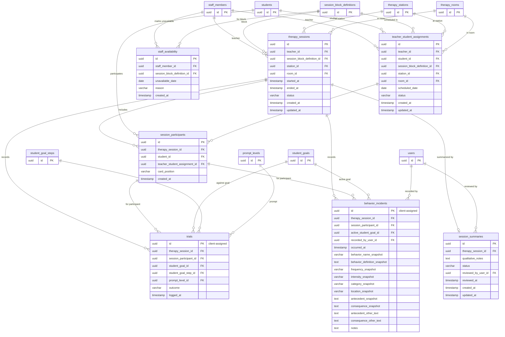

# Module 06 — Scheduling & Active Therapy

**Tables owned:** `teacher_student_assignments`, `staff_availability`, `therapy_sessions`, `session_participants`, `trials`, `behavior_incidents`, `session_summaries`

**Cross-module stubs:** `staff_members` (→ 01-identity), `students` (→ 03-students), `users` (→ 01-identity), `session_block_definitions` (→ 02-configuration), `therapy_stations` (→ 02-configuration), `therapy_rooms` (→ 02-configuration), `prompt_levels` (→ 02-configuration), `student_goals` (→ 05-iup-goals), `student_goal_steps` (→ 05-iup-goals)

**Enum values**

| Column | Values |
|---|---|
| `teacher_student_assignments.status` | `scheduled`, `cancelled`, `completed` |
| `therapy_sessions.status` | `in_progress`, `submitted`, `reviewed` |
| `session_participants.card_position` | `active`, `secondary` |
| `trials.outcome` | `correct`, `incorrect`, `no_response` |
| `session_summaries.status` | `draft`, `submitted`, `reviewed` |

**Key rules**
- A student cannot be assigned to more than one teacher in the same `session_block_definition` / `scheduled_date` combination
- A teacher cannot exceed `scheduling_policy.staff_student_capacity` assignments per block per date
- `trials.id` and `behavior_incidents.id` are **client-assigned UUIDs** — the server stores them as-is; a duplicate submission of the same UUID is a no-op, not a duplicate record
- `trials.student_goal_step_id` is required when the goal type is `task_analysis`; it must be absent for `standard` goals
- Every `behavior_incident` must reference a `session_participant`, an active `student_goal`, and a `recorded_by_user_id`
- All `behavior_incident` snapshot columns preserve the label/definition values at the time of recording — configuration changes cannot rewrite clinical history
- A `session_summary` transitions to `submitted` via the `/therapy-sessions/{id}/submit` command endpoint, not via a direct status write
