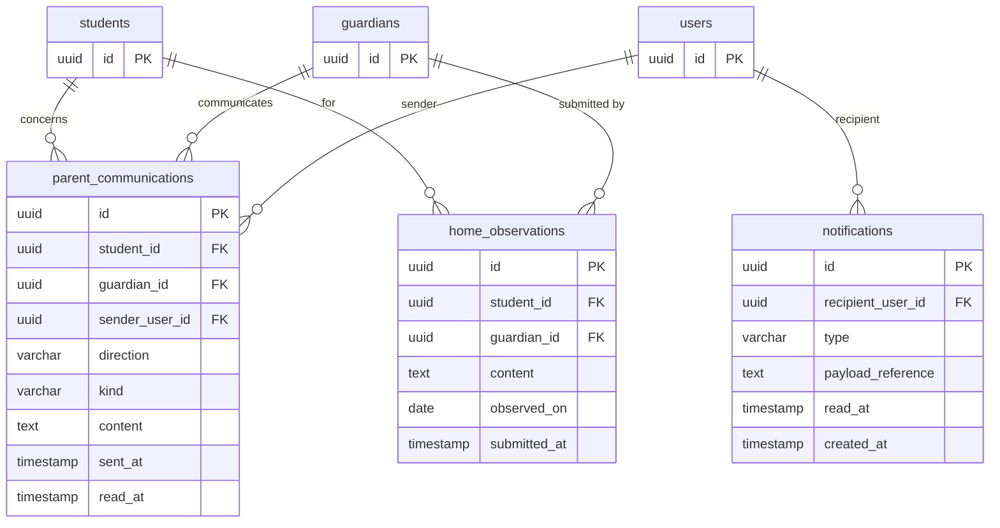

# Module 07 — Communication & Notifications

**Tables owned:** `parent_communications`, `home_observations`, `notifications`

**Cross-module stubs:** `students` (→ 03-students), `guardians` (→ 01-identity), `users` (→ 01-identity)

**Enum values**

| Column | Values |
|---|---|
| `parent_communications.direction` | `inbound`, `outbound` |
| `parent_communications.kind` | `progress_update`, `general`, `alert` |
| `notifications.type` | `stale_draft`, `mastery_decision`, `session_review`, `communication` |

**Key rules**
- `home_observations` are read-only from the therapy side — a guardian submission cannot alter any clinical record
- `parent_communications.direction` is `outbound` when staff send to guardian, `inbound` when guardian initiates
- `notifications.payload_reference` is a JSON pointer to the resource that triggered the notification (e.g. `{"type":"mastery_check","id":"..."}`)
- Threading, attachments, and multi-participant rules are not yet specified — do not add columns for them until the business defines the requirement
