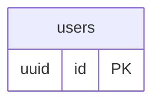

# Melue Foundation — ER Diagram Index

The ER diagram is split into 7 focused modules, one per bounded context.
Each module is self-contained: cross-module tables appear as stubs (key columns only)
to keep foreign key relationships readable without importing the full module.

## Modules

| File | Bounded Context | Tables |
|---|---|---|
| [01-identity.md](./01-identity.md) | Identity, Access & Audit | users, staff_members, guardians, roles, role_assignments, permissions, user_sessions, password_reset_requests, audit_entries |
| [02-configuration.md](./02-configuration.md) | Clinical Configuration, Forms & Facilities | therapy_stations, therapy_rooms, session_block_definitions, scheduling_policy, trial_logging_configuration, mastery_policy, prompt_levels, abc_options, form_definitions, form_revisions, form_field_definitions, form_submissions, item_subscale_mappings |
| [03-students.md](./03-students.md) | Students, Enrollment, Consent & Data Rights | students, student_guardians, enrollments, student_attachments, consent_records, data_subject_requests, internal_student_notes |
| [04-assessment.md](./04-assessment.md) | Six-Week Assessment | assessment_cycles, skills_assessments, ablls_skill_definitions, ablls_scores, behavior_assessments, behavior_function_analyses, motivation_assessment_scales, mas_responses, fast_screenings, fast_responses, assessment_abc_observations, preference_assessments, preference_inventory_items, preference_observations, sensory_time_assessments, sensory_activity_definitions, sensory_activity_results, social_skills_questionnaires |
| [05-iup-goals.md](./05-iup-goals.md) | IUP, Goal Bank & Mastery | goal_domains, goals, task_analysis_step_templates, iups, iup_signatures, student_goals, student_goal_steps, goal_mastery_checks, mastery_verifications |
| [06-scheduling-therapy.md](./06-scheduling-therapy.md) | Scheduling & Active Therapy | teacher_student_assignments, staff_availability, therapy_sessions, session_participants, trials, behavior_incidents, session_summaries |
| [07-communication.md](./07-communication.md) | Communication & Notifications | parent_communications, home_observations, notifications |

## Cross-Module Dependency Map

```
identity ◄──── students ◄──── assessment ◄──── iup-goals
   ▲               ▲                                 ▲
   │               │                                 │
configuration   scheduling ◄──── active-therapy ─────┘
                                       │
                                 communication
```

## Stub Convention

Tables from other modules appear with only their `id PK` column and a comment
indicating which module owns them. This keeps each diagram self-contained
without duplicating full column definitions.

Example:

