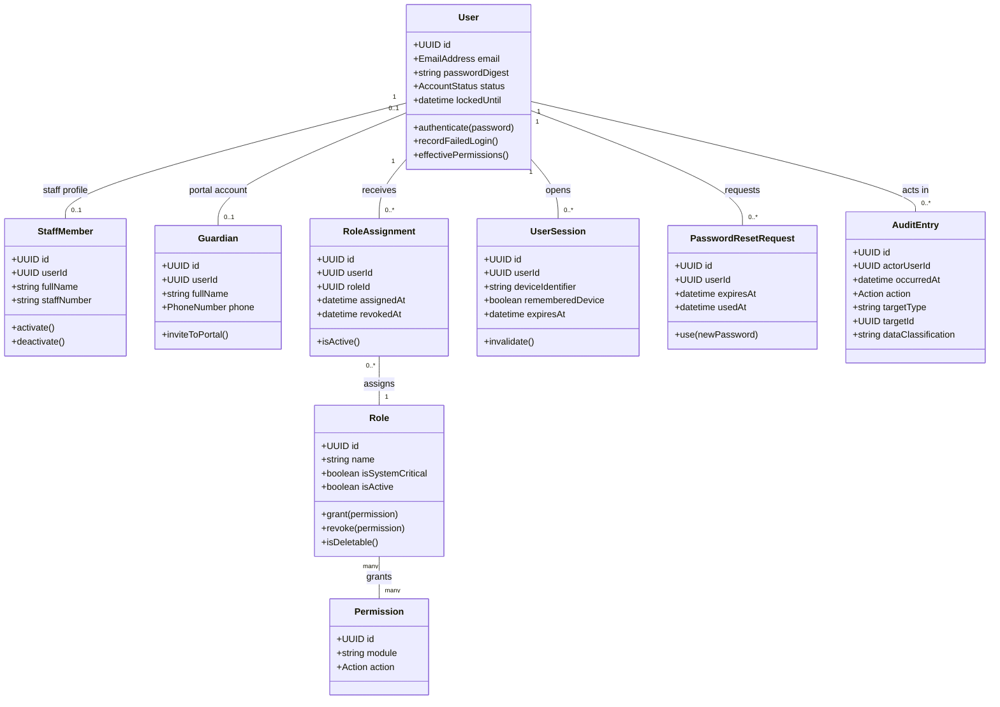
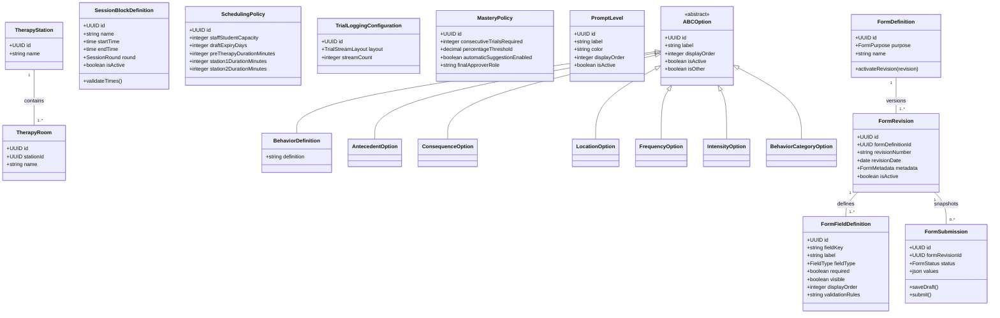
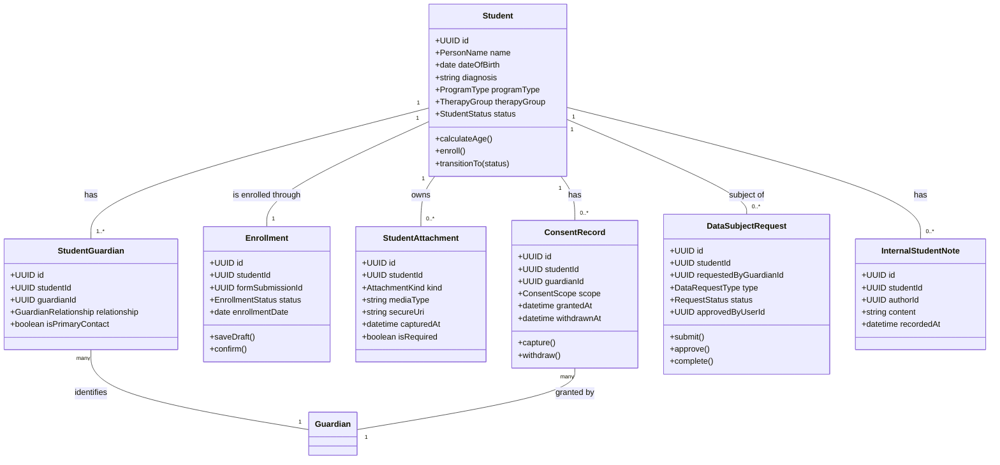
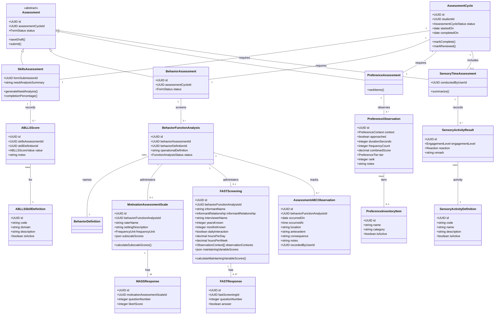
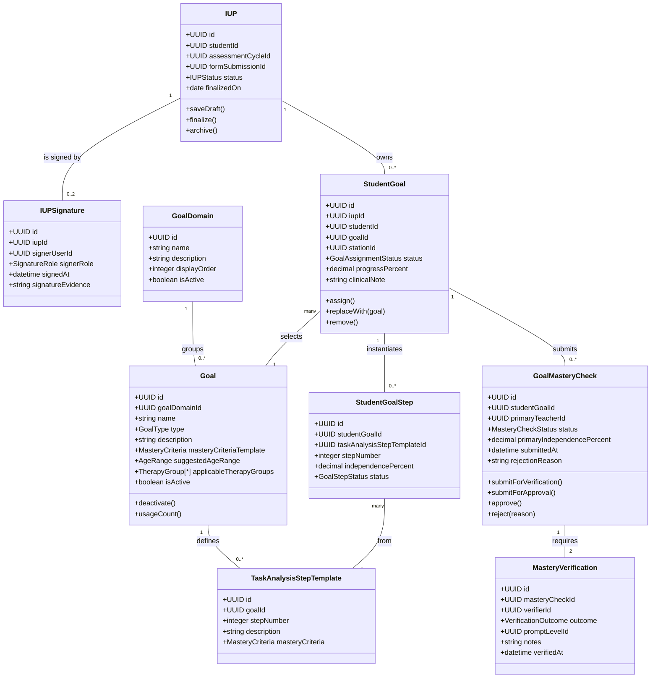
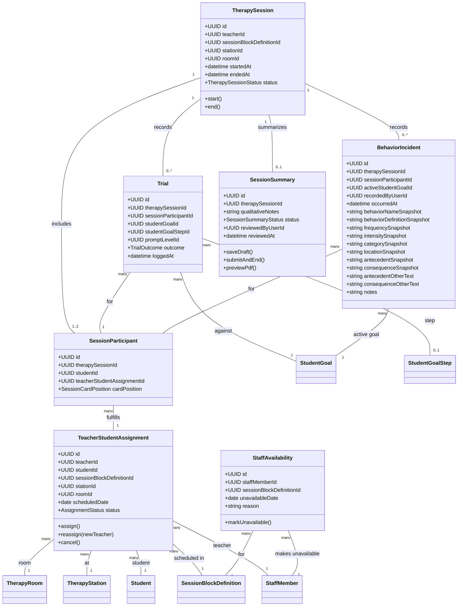
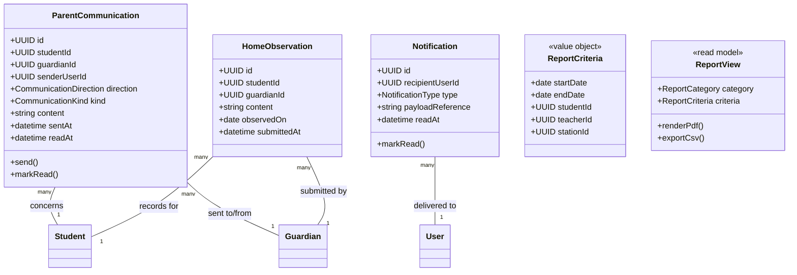

# Melue Foundation Therapy Management System — Domain Model

## Overview

This document defines the authoritative domain model for the Melue Foundation Therapy Management System. It covers all bounded contexts from identity and access control through clinical assessment, IUP authoring, active therapy, scheduling, and reporting. UUID fields in the entity tables are stable API identities and cross-context references; they are not prescriptions for database foreign keys or ORM design. Status, type, and other closed vocabularies are API enums. Derived views — dashboards, charts, and PDFs — are described as read models rather than invented as persistent domain entities where the SRS does not require their lifecycle.

---

## Design Decisions

The following decisions were made after reviewing the source clinical instruments and operational documents used at the foundation. They are recorded here as confirmed design choices.

1. **Physical station and IUP station slot are the same concept.** IUP goals are assigned to the physical therapy station where they are practiced. `StudentGoal.stationId` is a foreign key to `TherapyStation`, not a free-string enum. The label "Station 1 / Station 2" in the IUP maps directly to the two physical stations.

2. **Session participation model confirmed.** A `TherapySession` represents one teacher/block/room occurrence with one or two `SessionParticipant` records. The weekly session note form confirms one teacher, one time block, and an Active plus a Secondary student with separate trial logs per student. Each `SessionParticipant` owns its `Trial` and `BehaviorIncident` records.

3. **Guardian portal invitation is optional.** A guardian contact record is created at enrollment before any portal account is issued. Portal invitation is a separate, manually triggered step. A guardian may therefore exist without a linked user account.

4. **One active IUP per student at any time.** A student may have only one IUP with `status = active`. Activating a replacement IUP archives the prior one. This is enforced as a production invariant.

5. **Submitted forms lock to their revision.** A submitted clinical form (enrollment, IUP, ABLLS, Social Skills Questionnaire) is permanently associated with the `FormRevision` that was active at submission time. A later configuration change cannot alter a submitted clinical record.

6. **MAS-II scoring key confirmed.** The source instrument uses a standard 16-item, four-subscale structure: items 1, 5, 9, 13 → Sensory; items 2, 6, 10, 14 → Escape; items 3, 7, 11, 15 → Attention; items 4, 8, 12, 16 → Tangible. Each item is scored 0–6 (Never → Almost Always). Subscale score = sum of four items (range 0–24). Total score = sum of all four subscales (range 0–96). The `ItemSubscaleMapping` configuration table must be seeded with these 16 mappings at deployment.

7. **Social Skills Questionnaire is in scope.** This guardian-completed pre-enrollment questionnaire (Form ID `MCTC-TRP-006-01`) is confirmed for the initial release. It has nine subscales: Cooperation, Assertiveness, Responsibility, Empathy, Self-Control, Problem Behaviors, Hyperactivity, Internalizing, and Externalizing. It belongs in the Six-Week Assessment bounded context alongside ABLLS.

8. **Play Time is a context within Preference Assessment, not a separate instrument.** The `play_time` value in `PreferenceObservation.context` correctly represents the play-time free-operant observation phase of the Preference Assessment. The two distinct instruments are Sensory Time Assessment (structured probe) and Preference Assessment (free-operant observation including the play-time context). No separate Play Time entity is required.

9. **Client-generated UUIDs for offline sync.** Staff complete paper forms first and enter data afterward. The `id` fields on `Trial` and `BehaviorIncident` are assigned by the client before submission, enabling idempotent synchronization. The server must accept and honor client-assigned UUIDs for these two entities.

---

## 1. Identity, Access and Audit



| Entity / value | Key attributes | Actions / rules |
|---|---|---|
| `User` | id, email, passwordDigest, status (`active`, `inactive`, `locked`), lockedUntil | Authentication principal. authenticate(), recordFailedLogin(), effectivePermissions(). Email is globally unique. Five failed attempts lock the account for 15 minutes; inactive users cannot authenticate. |
| `StaffMember` | id, userId, fullName, staffNumber | Staff profile for Teacher, Coordinator, Director, Program Director, and administrators. Every staff profile has an account and access requires at least one active role. |
| `Guardian` | id, userId (optional), fullName, phone | Guardian contact/profile. It may exist at enrollment before an optional linked portal account is invited. |
| `Role` | id, name, isSystemCritical, isActive | grant(), revoke(), isDeletable(). System-critical roles and roles assigned to active staff are non-deletable. |
| `RoleAssignment` | id, userId, roleId, assignedAt, revokedAt | Explicit many-to-many association. Active assignments determine additive permissions; this supports assignment history. |
| `Permission` (value) | module, action (`view`, `create`, `edit`, `delete`, `approve`) | Role-owned action-level capability; no independent lifecycle is specified. |
| `UserSession` | id, userId, deviceIdentifier, rememberedDevice, expiresAt | A remembered device persists across app restarts. Timeout policy is configurable: staff default 15 minutes, guardian default 30 minutes. |
| `PasswordResetRequest` | id, userId, expiresAt, usedAt | Supports self-service and administrator-initiated reset flows without exposing a reset token as a domain attribute. |
| `AuditEntry` | id, actorUserId, occurredAt, action, targetType, targetId, dataClassification | Append-only access/change/delete record. Retain at least seven years; log sensitive PII access and configuration changes. |

**Notes:** Permission presets ("Reset to Default" and "Copy from Role") are role-configuration commands, not a domain entity mandated by the SRS. If the organization later needs reusable named templates, introduce `RoleTemplate` then; do not persist it prematurely.

---

## 2. Clinical Configuration, Forms and Facilities



| Entity / value | Key attributes | Actions / rules |
|---|---|---|
| `TherapyStation` / `TherapyRoom` | id, name; room.stationId | Physical facilities. A station owns one or more rooms. The SRS currently describes two stations and four rooms each, but does not require those counts to be hard-coded. |
| `SessionBlockDefinition` | id, name, startTime, endTime, round, isActive | Configured daily block. `endTime` must be later than `startTime`; custom blocks are permitted. This is a template, not a live therapy session. |
| `SchedulingPolicy` | staffStudentCapacity, draftExpiryDays, preTherapyDurationMinutes, station1DurationMinutes, station2DurationMinutes | Configured capacity, daily-duration, and stale-draft policy. Session blocks still own their individual start/end times. |
| `TrialLoggingConfiguration` | layout (`horizontal`, `vertical`, `card_grid`), streamCount | Stream count is constrained to 3-20. |
| `MasteryPolicy` | consecutiveTrialsRequired, percentageThreshold, automaticSuggestionEnabled, finalApproverRole | Configures mastery suggestion and whether Program Director or Director makes final approval. It must be reconciled with the mandatory two-teacher verification rule. |
| `PromptLevel` | id, label, color, displayOrder, isActive | Label is unique; FP, PP, G, and + are initial configured values, not hard-coded enums. |
| `ABCOption` specializations | id, label, order, active, isOther; behavior includes definition | All dropdown values configurable, reorderable, active/inactive. `isOther` opens a text field. Separate types preserve valid option sets and behavior definitions. |
| `FormDefinition` | id, purpose (`enrollment`, `iup`, `ablls`), name | Logical configurable form. Parent interview content may use an enrollment form submission until a distinct configured form is required. |
| `FormRevision` | id, formDefinitionId, revisionNumber, revisionDate, metadata, isActive | Immutable version entity that captures form ID, name, revision, organization name, and field layout. A submitted clinical form references its revision permanently. |
| `FormFieldDefinition` | key, label, fieldType, required, visible, order, validationRules | Supports required field types, labels, visibility, order, and imported templates. |
| `FormSubmission` | id, formRevisionId, status, values | Generic draft/complete dynamic data. Used by Enrollment, IUP, and Skills Assessment. It is an owned record, not an independent user-facing resource. |

**Notes:** `FormMetadata` is an immutable value object: `formId`, `formName`, `revisionNumber`, `revisionDate`, and `organizationName`. Page number is calculated during rendering, not stored. PDF exports must render this metadata in every page header.

---

## 3. Student, Enrollment, Consent and Data Rights



| Entity / value | Key attributes | Actions / rules |
|---|---|---|
| `Student` | id, name, dateOfBirth, diagnosis, programType (`regular`, `pulled_out`), therapyGroup (`basic`, `functional_living`), status | calculateAge(), enroll(), transitionTo(). Basic Therapy expected age is 3-12 and Functional Living Skills 13-19; the SRS requires a mismatch warning, not an explicit hard rejection. |
| `StudentGuardian` | studentId, guardianId, relationship, isPrimaryContact | Explicit relationship allows one guardian for multiple children and multiple guardians per student. At least one guardian is required at confirmation. |
| `Enrollment` | id, studentId, formSubmissionId, status (`draft`, `confirmed`, `purged`), enrollmentDate | saveDraft(), confirm(). Confirmation validates configured required fields, any attachment made required by form/policy, the SRS-mandated headshot, guardian, consent, and placement; it transitions the student to `in_assessment`. |
| `StudentAttachment` | id, studentId, kind (`birth_certificate`, `medical_diagnosis`, `agreement`, `headshot`, `baseline_video`), mediaType, secureUri, capturedAt, isRequired | Secure-file metadata. Headshot is mandatory for confirmed enrollment; baseline video is optional and can be added later by authorized staff. |
| `ConsentRecord` | id, studentId, guardianId, scope, grantedAt, withdrawnAt | Digital, permanent evidence of consent. Confirmed scope values: `child_data`, `medical_records`, `photos`, `video`, `audio_recording`. Consent wording/version should be stored in its immutable evidence payload. |
| `DataSubjectRequest` | id, studentId, requestedByGuardianId, type (`access`, `erasure`), status, approvedByUserId | Supports access export and erasure requests. Erasure requires Director confirmation and must produce an audit event. Retention/legal-hold conflict resolution is unspecified by the SRS. |
| `InternalStudentNote` | id, studentId, authorId, content, recordedAt | Director-only note; it must never be returned by parent/teacher APIs. |

**Notes:** `Student.status` lifecycle is `in_assessment` → `assessment_complete` → `ready_for_iup` → `active_therapy` → `withdrawn` / `discharged`, with archival/retention states managed operationally. The business has confirmed `withdrawn` (guardian-initiated exit before completion) and `discharged` (clinical completion) as terminal states; add them to the status enum.

---

## 4. Six-Week Assessment and Clinical Reference Data



| Entity / value | Key attributes | Actions / rules |
|---|---|---|
| `AssessmentCycle` | id, studentId, status (`in_progress`, `complete`, `reviewed`), startedOn, completedOn | Root for the six-week workflow. It owns completion/review transition: Skills, Behavior, and Preference must be complete before `complete`; review changes student status to `ready_for_iup`. |
| `Assessment` (abstract) | id, assessmentCycleId, status | Shared draft/submit behavior. This is a meaningful common abstraction; each subtype has a different calculation model. |
| `SkillsAssessment` | formSubmissionId, needAnalysisSummary | generateNeedAnalysis(), completionPercentage(). The submission preserves the ABLLS form revision used. |
| `ABLLSSkillDefinition` | id, code, domain, description, isActive | Preloaded, configurable skill catalogue. Existing scores must keep their selected definition/code snapshot if catalogue labels change. |
| `ABLLSScore` | skillsAssessmentId, skillDefinitionId, value (`0`, `1`, `2`, `not_applicable`), notes | One score per skill in an assessment. The summary highlights domains with the most 0/1 values. |
| `BehaviorAssessment` | id, assessmentCycleId, status | A thin container whose status is complete only when every child `BehaviorFunctionAnalysis` is complete. |
| `BehaviorFunctionAnalysis` | id, behaviorAssessmentId, behaviorDefinitionId, operationalDefinition, status | One record per problem behavior under analysis, matching the MAS-II's `Behavior Description` and the FAST's `Behavior Problem` fields. `behaviorDefinitionId` references the same catalogue `BehaviorIncident` uses. `operationalDefinition` is captured per case, since assessors write a case-specific definition even for a catalogued behavior name. |
| `MotivationAssessmentScale` | id, behaviorFunctionAnalysisId, raterName, settingDescription, frequencyUnit (`year`/`month`/`week`/`day`/`hour`), subscaleScores | Header fields (rater, setting, frequency) match the source form. `subscaleScores` holds five subscales — Sensory, Escape-Demands, Escape-Attention, Attention, Tangible — each with total, mean, and rank. |
| `MASSResponse` | motivationAssessmentScaleId, questionNumber (1-16), likertScore (0-6) | Raw item response. All 16 are required; the instrument has no skip logic. |
| `FASTScreening` | id, behaviorFunctionAnalysisId, informantName, informantRelationship (`parent`/`teacher_instructor`/`residential_staff`/`other`), interviewerName, yearsKnown, monthsKnown, dailyInteraction, hoursPerDay, hoursPerWeek, observationContexts (multi-select), maintainingVariableScores | `maintainingVariableScores` holds five counts of "Yes" answers over overlapping item sets. See scoring notes below. |
| `FASTResponse` | fastScreeningId, questionNumber (1-27), answer | Items 1-3 and 19-27 are always required. Items 4-18 (Part II) apply, and are therefore only required, when any of items 1-3 is "Yes" — a response set with Part II entirely absent is valid, not incomplete. |
| `AssessmentABCObservation` | id, behaviorFunctionAnalysisId, occurredOn, occurredAt, location, antecedent, consequence, notes, recordedByUserId | Scoped to the specific behavior it documents, matching the "one ABC log per behavior" pattern in every source sheet. Antecedent/consequence stay free text, since source sheets show assessors writing prose rather than selecting configured options. |
| `PreferenceInventoryItem` | id, name, category, isActive | Foundation catalogue. Inventory changes must not erase past observations. |
| `PreferenceObservation` | context (`sensory_time`/`circle_time`/`play_time`), approached, durationSeconds, frequencyCount, combinedScore, tier (`highest`/`moderate`/`low`), rank, notes | `approached` corresponds to the real form's primary Approached/Did-Not-Approach field. `tier` represents the three-way categorical grouping ("Highest / Moderately / Low Preferred"); both tier and numeric rank are retained since charts are likely to need the rank. |
| `SensoryTimeAssessment` / `SensoryActivityResult` | status, conductedByUserId; engagementLevel, reaction, remark | `conductedByUserId` records who administered it, matching the paper form's signature line. Not modeled as a full digital signature; confirm with the foundation if e-signature capture is required here as it is for the IUP. |
| `SensoryActivityDefinition` | code, name, description, isActive | Configurable inventory with the SRS default activity set. |

### Instrument Scoring Reference

**FAST (Functional Analysis Screening Tool):** The five maintaining-variable scores are computed directly from the printed scoring grid on the source form. Attention = items 1, 2, 3, 4, 5, 6, 7, 8; access-to-items = 1, 2, 3, 9, 10, 11, 12, 13; escape = 1, 2, 3, 14, 15, 16, 17, 18; sensory-stimulation = 19, 20, 21, 22, 23, 24; pain-attenuation = 19, 20, 24, 25, 26, 27. Each score is a count of "Yes" answers within its item set. Items 1-3 and 19/20/24 deliberately appear in multiple subscales — this overlap is by design, not a data error.

**MAS-II (Motivation Assessment Scale II):** The instrument uses the standard 16-item, four-subscale Durand & Crimmins structure. Items 1, 5, 9, 13 → Sensory; items 2, 6, 10, 14 → Escape; items 3, 7, 11, 15 → Attention; items 4, 8, 12, 16 → Tangible. Each item is scored 0–6. Subscale score = sum of four items (0–24); total score = sum of all subscales (0–96). The item-to-subscale mapping is stored in an `ItemSubscaleMapping` configuration table (16 seed rows) rather than hard-coded, so that the foundation can update it if the instrument version changes. The `MASSResponse` model therefore uses `questionNumber` 1–16, not 1–51 as previously estimated from a reconstruction.

**Social Skills Questionnaire:** This guardian-completed pre-enrollment instrument is in scope for the initial release. It follows the same `FormDefinition` / `FormRevision` / `FormSubmission` pattern used by enrollment and ABLLS forms. The nine subscale scores (Cooperation, Assertiveness, Responsibility, Empathy, Self-Control, Problem Behaviors, Hyperactivity, Internalizing, Externalizing) are stored within `FormSubmission.values` and computed during reporting. No additional entity is required beyond a configured `FormDefinition` with `purpose = social_skills_questionnaire`.

**Notes:** `ABLLSScoreValue`, `EngagementLevel`, `Reaction`, `PreferenceContext`, `FrequencyUnit`, and `InformantRelationship` are value enums. The skills, behavior, and preference components are mandatory; Sensory Time Engagement is optional because the SRS describes it as an additional `FR-051` assessment and does not state it gates transition to IUP.

---

## 5. IUP, Goal Bank and Mastery Governance



| Entity / value | Key attributes | Actions / rules |
|---|---|---|
| `IUP` | id, studentId, assessmentCycleId, formSubmissionId, status (`draft`, `active`, `archived`), finalizedOn | saveDraft(), finalize(), archive(). Uses the reviewed assessment cycle and an IUP form submission. Finalization requires at least one goal per applicable `stationSlot` and both required signatures. |
| `IUPSignature` | iupId, signerUserId, signerRole (`program_director`, `guardian`), signedAt, signatureEvidence | Exactly one Program Director and one guardian signature are required at finalization. The guardian must be associated with the student. |
| `GoalDomain` | id, name, description, displayOrder, isActive | Configurable goal category. Cannot be deleted while referenced by a goal. |
| `Goal` | id, goalDomainId, name, type (`standard`, `task_analysis`), description, masteryCriteriaTemplate, suggestedAgeRange, applicableTherapyGroups, isActive | deactivate(), usageCount(). Inactive goals cannot be newly assigned; a goal with active assignments cannot be deleted. `applicableTherapyGroups` enforces IUP assignment validation. |
| `TaskAnalysisStepTemplate` | goalId, stepNumber, description, masteryCriteria | Ordered template steps. Required only when `Goal.type = task_analysis`; order is unique within the goal. |
| `StudentGoal` | iupId, studentId, goalId, stationId (FK → `TherapyStation`), status, progressPercent, clinicalNote | The student-specific goal assignment. `stationId` references the physical station where the goal is practiced; it is the same concept as the "Station 1 / Station 2" label in the IUP form. A goal must apply to the student's therapy group. There can be no more than two active assignments per station. |
| `StudentGoalStep` | studentGoalId, taskAnalysisStepTemplateId, stepNumber, independencePercent, status | Per-student progress for task analysis. It is created from the template when the assignment is created, preserving the version used. |
| `GoalMasteryCheck` | studentGoalId, primaryTeacherId, status (`draft`, `awaiting_verification`, `pending_approval`, `approved`, `rejected`), primaryIndependencePercent, submittedAt, rejectionReason | Requires 100% primary-teacher independence before verification. On approval, the student goal becomes mastered/archived; rejection restores active/in-progress and notifies the primary teacher. |
| `MasteryVerification` | masteryCheckId, verifierId, outcome (`success`, `fail`), promptLevelId, notes, verifiedAt | Exactly two records with two distinct teachers, neither equal to the primary teacher. Prompt level is mandatory when outcome is fail. Both outcomes must be supplied before approval submission. |

**Notes:** The default IUP's sections (student/assessment summary, reinforcement, consequence, family plan, behavior reduction, replacement goals, antecedent manipulation, crisis plan, care coordination, discharge/titration, and signatures) belong in the versioned `FormSubmission.values` payload. They should not be turned into a dozen rigid tables while the SRS explicitly requires a configurable form builder.

---

## 6. Scheduling, Active Therapy and Session Summary



| Entity / value | Key attributes | Actions / rules |
|---|---|---|
| `TeacherStudentAssignment` | id, teacherId, studentId, sessionBlockDefinitionId, stationId, roomId, scheduledDate, status | assign(), reassign(), cancel(). The scheduling aggregate enforces staff capacity and prohibits a student having two teachers in the same block/date. |
| `StaffAvailability` | id, staffMemberId, sessionBlockDefinitionId, unavailableDate, reason | markUnavailable(). A coordinator can reassign impacted assignments only to an available teacher with capacity. |
| `TherapySession` | id, teacherId, blockDefinitionId, stationId, roomId, startedAt, endedAt, status | Actual occurrence created from scheduled work. It is not the same entity as a configured session-block definition. |
| `SessionParticipant` | therapySessionId, studentId, teacherStudentAssignmentId, cardPosition (`active`, `secondary`) | Represents the one or two students shown in the dashboard. A session has distinct student participants; swapping cards changes only presentation position. |
| `Trial` | therapySessionId, sessionParticipantId, studentGoalId, studentGoalStepId, promptLevelId, outcome, loggedAt | Immutable clinical data. `studentGoalId` is always required. `studentGoalStepId` is required for task-analysis goals and absent for standard goals; it is not an XOR with `studentGoalId`. |
| `BehaviorIncident` | session/participant/goal/recorder IDs, occurredAt, selected-value snapshots, antecedentOtherText, consequenceOtherText, notes | Structured ABC incident. It references active configuration at entry time but stores label/definition snapshots for clinical history. The SRS requires every incident to link to student, session, active goal, and teacher. |
| `SessionSummary` | therapySessionId, qualitativeNotes, status (`draft`, `submitted`, `reviewed`), reviewedByUserId, reviewedAt | saveDraft(), submitAndEnd(), previewPdf(). The teacher submits it to the Therapy Coordinator; totals, prompt breakdowns, and incidents are derived from the session's immutable logs. |

**Notes:** A `TherapySession` must be able to operate offline. Queueing/synchronization, conflict resolution, local storage, and transport encryption are technical architecture concerns and are not domain entities. `Trial.id` and `BehaviorIncident.id` are client-assigned UUIDs: the client generates the ID before the record is submitted, and the server stores it as-is. This ensures idempotent synchronization — a duplicate submission of the same UUID is a no-op, not a duplicate clinical event.

---

## 7. Parent Communication, Notifications and Reporting



| Entity / value | Key attributes | Actions / rules |
|---|---|---|
| `ParentCommunication` | id, studentId, guardianId, senderUserId, direction, kind, content, sentAt, readAt | send(), markRead(). Supports teacher/staff progress sharing and parent-originated communication. Threading, attachments, and participant rules are not specified; do not assume them yet. |
| `HomeObservation` | id, studentId, guardianId, content, observedOn, submittedAt | Parent's home update. It is deliberately separate from a clinical session note and cannot alter therapy records. |
| `Notification` | id, recipientUserId, type, payloadReference, readAt | Delivery record for stale drafts, mastery decisions, session reviews, and communications. Push/email are delivery channels, not domain state. |
| `ReportCriteria` (value) | date range and optional student, teacher, station filters | Input to report/chart generation. |
| `ReportView` (read model) | category, criteria | Session reports, bi-annual reports, student progress, and foundation overview are derived from assessments, IUPs, sessions, trials, incidents, assignments, and notes. Persist an exported file only if future retention requirements demand it. |

---

## Production Invariants

| Invariant | Responsible Aggregate / Service |
|---|---|
| Active user email is unique; a user locks after five failed attempts; inactive/locked users cannot authenticate. | Identity service / `User` |
| Active staff must hold at least one active role; effective privileges are the union of all active role assignments. | `User` + `RoleAssignment` + authorization service |
| A system-critical role, or a role held by active staff, cannot be deleted. | `Role` administration service |
| Confirming enrollment requires form-required data, primary guardian, required consent, any policy-required attachment, and the mandatory headshot. | `Enrollment` |
| Basic/Functional placement mismatch is warned; the exact override/approval rule needs business confirmation. | Student placement policy |
| Draft enrollment/assessment/IUP records warn and purge according to configured policy; final clinical records are never purged by that rule. | Draft lifecycle policy |
| An assessment cycle cannot complete until Skills, Behavior, and Preference assessments are completed. | `AssessmentCycle` |
| A `BehaviorAssessment` cannot complete until every `BehaviorFunctionAnalysis` it owns is complete; a `BehaviorFunctionAnalysis` requires at least a completed `MotivationAssessmentScale` or `FASTScreening` (business rule to confirm — the SRS doesn't state whether both instruments are mandatory per behavior). | `BehaviorAssessment` / `BehaviorFunctionAnalysis` |
| A `MotivationAssessmentScale` requires all 16 `MASSResponse` records (one per item) before it can be marked complete; there is no partial-completion state. | `MotivationAssessmentScale` |
| A `FASTScreening` requires responses for items 1-3 and 19-27 always; items 4-18 are required only if any of items 1-3 is "Yes," and must be entirely absent otherwise. | `FASTScreening` |
| A Goal is deleted only when no active StudentGoal references it; a GoalDomain is deleted only when no Goal references it. | Goal catalogue administration service |
| A finalized IUP has at least one goal in every applicable station slot, at most two active goals per slot, and both required signatures. | `IUP` |
| At most one `IUP` with `status = active` per student at any time. Activating a new IUP archives all prior active IUPs for that student. | `IUP` |
| A StudentGoal assignment must match the IUP's student and an applicable therapy group. | `IUP` / goal assignment policy |
| Task-analysis goals have ordered template steps; task-analysis trials name a StudentGoalStep and standard trials do not. | `Goal` / `Trial` validation |
| A scheduled student is not assigned to more than one teacher in the same date/block, and teacher capacity is not exceeded. | Scheduling service / `TeacherStudentAssignment` |
| Each active-session BehaviorIncident names one session participant, active StudentGoal, and recorder; selected ABC values are retained as snapshots. | `TherapySession` |
| A mastery check requires 100% primary-teacher independence, exactly two distinct additional teacher verifications, and an outcome for both before it becomes pending approval. | `GoalMasteryCheck` |
| A rejected mastery check restores StudentGoal to active/in-progress; approval marks it mastered and archives it, retaining approver/date/history. | `GoalMasteryCheck` + `StudentGoal` |
| Audit records are append-only and retained at least seven years. Student data, attachments, assessment, and session records meet the stated five-year/archival policy. | Compliance / retention service |

---

## Cross-Context Reference Map

| Entity | Depends on / references | Ownership reason |
|---|---|---|
| `Enrollment` | Student, FormSubmission, StudentAttachment, StudentGuardian, ConsentRecord | Student owns the enrollment outcome; confirmation must validate all required evidence together. |
| `AssessmentCycle` | Student, four assessment components | Owns the three-assessment completion invariant and the review-to-IUP transition. |
| `IUP` | Student, reviewed AssessmentCycle, FormSubmission, StudentGoal, IUPSignature | Owns plan content, goal slots, signatures, finalization, and archival. |
| `StudentGoal` | IUP, Student, Goal, optional StudentGoalStep, GoalMasteryCheck | Represents the student-specific lifecycle of a catalogue goal. The redundant student ID is a deliberate API/query denormalization; it must match `IUP.studentId`. |
| `TeacherStudentAssignment` | StaffMember, Student, SessionBlockDefinition, TherapyStation, TherapyRoom | Scheduling join resource; owns capacity and double-booking validation. |
| `TherapySession` | Assignment(s), participants, trials, incidents, summary | Owns the actual clinical occurrence and submitted-session lifecycle. |
| `BehaviorIncident` | TherapySession, SessionParticipant, StudentGoal, ABC configuration | Must preserve selection snapshots in addition to configuration references. |
| `ParentCommunication` / `HomeObservation` | Student, Guardian, User | Communications reference clinical data through the student context; they do not own it. |
| `AuditEntry` | User actor and any resource target | Separate append-only compliance aggregate; never part of the mutated entity's transaction graph. |

---

## SRS Traceability

| SRS source | Primary model coverage |
|---|---|
| FR-001–FR-018: authentication, staff, roles, permissions | `User`, `StaffMember`, `Guardian`, `UserSession`, `PasswordResetRequest`, `RoleAssignment`, `Role`, `Permission` |
| FR-019–FR-033: registration, enrollment, documents, placement, drafts | `Student`, `Enrollment`, `StudentGuardian`, `StudentAttachment`, `FormSubmission`, `SchedulingPolicy` |
| FR-034–FR-051: six-week skills, behavior, ABC, preference, sensory assessments | `AssessmentCycle`, assessment subclasses, `BehaviorFunctionAnalysis`, `MotivationAssessmentScale`, `FASTScreening`, scores/responses/observations, clinical catalogues |
| FR-052–FR-070: assessment review and IUP generation | `AssessmentCycle`, `IUP`, `StudentGoal`, `IUPSignature`, `FormSubmission` |
| FR-071–FR-087: goal bank, task analysis, charts, sharing | `GoalDomain`, `Goal`, `TaskAnalysisStepTemplate`, `StudentGoal`, `StudentGoalStep`, `ReportView`, `ParentCommunication` |
| FR-088–FR-114: active therapy, ABC incidents, mastery and session summaries | `TherapySession`, `SessionParticipant`, `Trial`, `BehaviorIncident`, `GoalMasteryCheck`, `MasteryVerification`, `SessionSummary` |
| FR-115–FR-125: scheduling, availability and operational alerts | `TeacherStudentAssignment`, `StaffAvailability`, `SessionBlockDefinition`, `SchedulingPolicy` |
| FR-126–FR-136: reporting and oversight | `ReportCriteria`, `ReportView`, `InternalStudentNote`, plus clinical source aggregates |
| FR-137–FR-156: forms, prompts, ABC options, schedules, goal domains, audit | Configuration context and `AuditEntry` |
| NFR-009–NFR-024, OR-001–OR-004 | `UserSession`, `AuditEntry`, `ConsentRecord`, `DataSubjectRequest`, `StudentAttachment`, lifecycle/retention policies |

---

## REST Resource Tree

```text
/auth/login
/auth/password-resets
/auth/sessions

/users
/staff
/guardians
/roles
  /:roleId/assignments
  /:roleId/permissions
/permissions
/audit-entries                         # privileged, append-only read access

/configuration
  /stations
    /:stationId/rooms
  /session-block-definitions
  /scheduling-policy
  /trial-logging
  /mastery-policy
  /prompt-levels
  /abc-options                         # type discriminator / filtered collections
  /forms
    /:formId/revisions
  /goal-domains

/students
  /:studentId/enrollment
  /:studentId/guardians
  /:studentId/attachments
  /:studentId/consents
  /:studentId/data-subject-requests
  /:studentId/internal-notes
  /:studentId/assessment-cycles
  /:studentId/iups
  /:studentId/communications
  /:studentId/home-observations

/assessment-cycles
  /:assessmentCycleId/skills-assessment
    /:skillsAssessmentId/ablls-scores
  /:assessmentCycleId/behavior-assessment
    /behavior-functions                          # BehaviorFunctionAnalysis collection
      /:behaviorFunctionId/motivation-scale       # MAS-II (0..1)
      /:behaviorFunctionId/fast-screening         # FAST (0..1)
      /:behaviorFunctionId/abc-observations       # per-behavior ABC log
  /:assessmentCycleId/preference-assessment
    /observations
  /:assessmentCycleId/sensory-time-assessment
    /results
  /:assessmentCycleId/social-skills-questionnaire   # guardian-completed pre-enrollment instrument

/goals
  /:goalId/task-analysis-steps
/student-goals
  /:studentGoalId/mastery-checks
    /:masteryCheckId/verifications

/teacher-student-assignments
/staff/:staffId/unavailability
/therapy-sessions
  /:therapySessionId/participants
  /:therapySessionId/trials
  /:therapySessionId/incidents
  /:therapySessionId/summary

/notifications
/reports                              # query/read-model/export endpoints
```

### API Design Notes

- Use command endpoints for guarded transitions: `/enrollment/confirm`, `/assessment-cycles/{id}/complete`, `/iups/{id}/finalize`, `/student-goals/{id}/mastery-checks`, `/mastery-checks/{id}/approve`, `/therapy-sessions/{id}/submit`. Do not expose unrestricted status mutation.
- `RoleAssignment`, `StudentGuardian`, `TeacherStudentAssignment`, `StudentGoal`, and `SessionParticipant` are relationship resources with business attributes; avoid hiding them as anonymous many-to-many joins.
- Expose `Goal.type` as a discriminator. Accept `taskAnalysisSteps` only for `task_analysis` goals; reject task-step trial payloads for standard goals.
- Make `FormSubmission` nested beneath its clinical owner. Clients should see form revision metadata and values, but must not be allowed to change a submitted snapshot.
- Treat reports, charts, and PDF previews as derived query/export operations. They are not separate clinical aggregates in the SRS.
- Support idempotent offline writes for trials, incidents, assessment observations, and messages. This is an API reliability requirement inferred from the SRS's offline-first mandate, not an extra domain entity.
- `GET /configuration/scheduling-policy` returns a single object, not a collection. There is one scheduling policy per organization; use PUT to update it in place.
